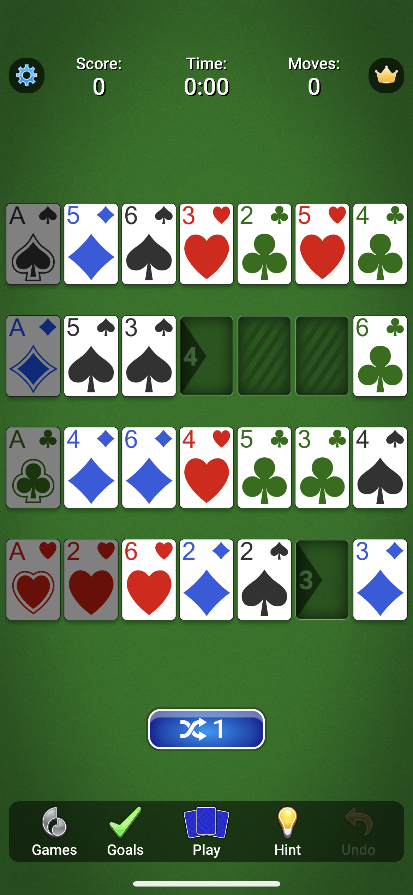

# addiction
Program to solve the addiction solitaire game.

## Prerequisites

Should work with any recent version of Python.

## Usage

    python addiction.py

You will be prompted to enter the board row by row. You can enter each card as a
two-character string where the first character is the suit and the second
character is the value, e.g. "DA" for the ace of diamonds or "S6" for the six of
spades. Cards are delimited by commas. Use an extra comma to represent a blank
space.

Example:

    Row 1: SA,D5,S6,H3,C2,H5,C4
    Row 2: DA,S5,S3,,,,C6
    Row 3: CA,D4,D6,H4,C5,C3,S4
    Row 4: HA,H2,H6,D2,S2,,D3

The program will then output the solution, move by move:

    S4 to Row 2, Col 4
    C4 to Row 3, Col 7
    S5 to Row 2, Col 5
    D2 to Row 2, Col 2
    S6 to Row 2, Col 6
    H6 to Row 1, Col 7
    S3 to Row 4, Col 6
    D3 to Row 2, Col 3
    S4 to Row 4, Col 7
    H3 to Row 4, Col 3
    H4 to Row 4, Col 4
    D6 to Row 1, Col 3
    D5 to Row 3, Col 3
    D6 to Row 3, Col 4
    S2 to Row 1, Col 2
    S3 to Row 1, Col 3
    H5 to Row 4, Col 5
    C3 to Row 1, Col 6
    H6 to Row 4, Col 6
    D4 to Row 2, Col 4
    C6 to Row 3, Col 6
    S4 to Row 1, Col 4
    C2 to Row 3, Col 2
    S5 to Row 1, Col 5
    D5 to Row 2, Col 5
    C3 to Row 3, Col 3
    S6 to Row 1, Col 6
    D6 to Row 2, Col 6
    C4 to Row 3, Col 4

## Testing

    pytest test_addiction.py

## Notes

The program does not assume that the puzzle can be solved without shuffling.
It tries to maximize the number of cards locked in, and to do so in the
fewest moves. Since it does not take account of shuffling, it's possible
that partially solving the puzzle, then shuffling and then completing the
puzzle may result in fewer moves than the optimum solution this program finds.